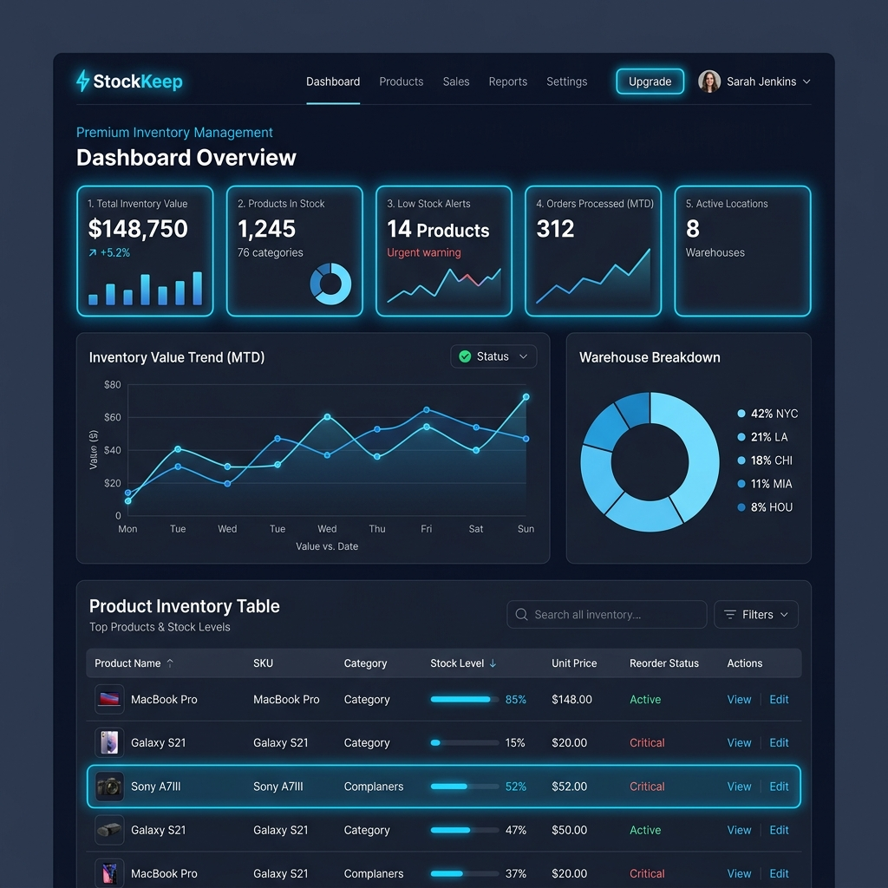

# 💎 StockKeep: AI-Powered Premium Inventory Management



> **StockKeep** is a high-end, modern inventory solution designed for speed, elegance, and intelligence. Featuring a **Self-Healing AI Import** system and a **Premium Glassmorphism UI**, it transforms how you manage your warehouse.

---

### ✨ Key Features

- 🧠 **AI-Powered Smart Import**: Seamlessly import products from raw text or CSV using Google Gemini. Features automatic retries and model fallback for 100% reliability.
- 🎨 **Luxurious UI/UX**: Ultra-smooth transitions (0.45s), dynamic glowing cards, and a refined glassmorphism aesthetic that works beautifully in both Dark and Light modes.
- 🚀 **Real-time Dashboard**: Instant analytics with interactive charts (Pies & Bars) and live stock-health monitoring.
- 🌓 **Dynamic Theme Sync**: A professional "Modern Blue" palette that adapts perfectly to your lighting environment.
- ⚡ **Snappy Interactions**: Perfectly synchronized sidebar and content layout for a desktop-class web experience.

---

### 🛠️ Tech Stack


---

### 🚀 Getting Started

#### 1. Clone the repository
```bash
git clone https://github.com/ReidOates/StockKeep.git
cd StockKeep
```

#### 2. Backend Setup
```bash
cd backEnd
npm install
# Create a .env file with your GEMINI_API_KEY
npm start
```

#### 3. Frontend Setup
```bash
cd ../frontEnd
npm install
npm run dev
```

---

### 🌌 Visual Elegance
StockKeep focuses on the **"WOW" factor**. Every micro-interaction, from the shimmering buttons to the floating cards, is designed to feel state-of-the-art.

---

### 🛡️ Security Note
The system is pre-configured with a `.gitignore` that protects your sensitive `.env` files. Your API keys stay local.

---

*Built with ❤️ by ReidOates & Antigravity AI*
